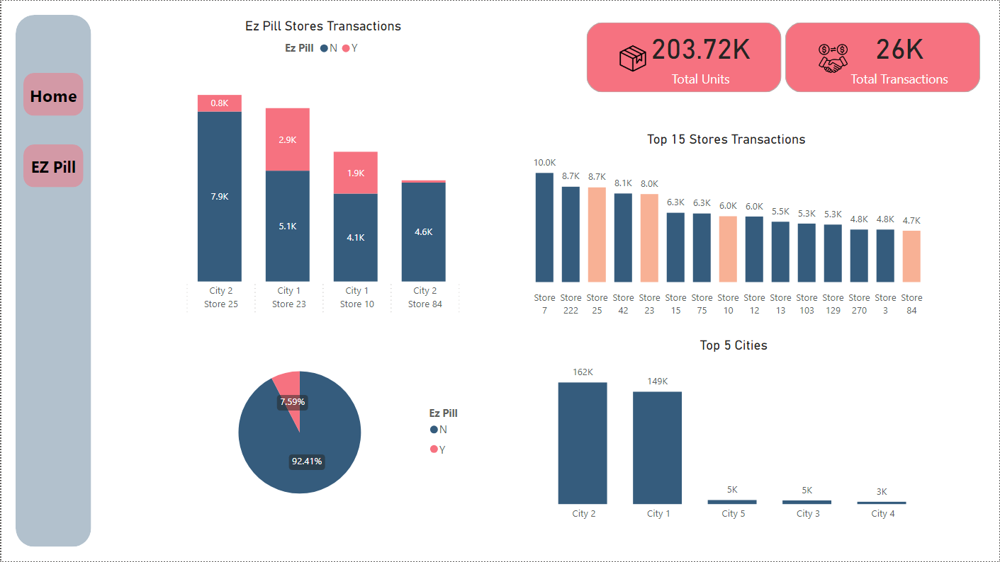
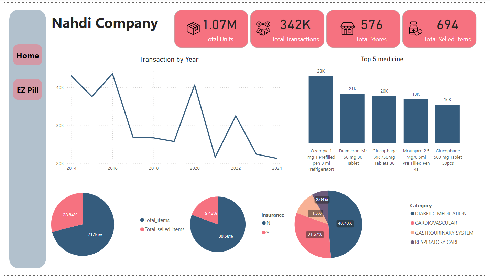

# Power BI Project: Chronic Medication Sales Analysis

## Overview
This Power BI project focuses on analyzing the performance of chronic medication sales and identifying opportunities for improving the **Ez-Pill** service. The analysis highlights key insights, investment opportunities, and recommendations for expanding the use of Ez-Pill devices.

---

## Objectives
1. **Assess the Current Situation**: Analyze the performance of chronic medication sales.
2. **Identify Opportunities**: Highlight areas for improvement and investment.
3. **Improve Ez-Pill Service**: Provide actionable insights to enhance the performance of Ez-Pill devices.
4. **Expansion Opportunities**: Analyze data to recommend the best stores for deploying additional Ez-Pill devices.

---

## Methodology
1. **Data Cleaning**:
   - Prepared and cleaned the dataset to ensure accuracy and consistency.
   - Handled missing values, removed duplicates, and standardized data formats.

2. **Data Modeling**:
   - Established relationships between tables to create a robust data model.
   - Used Power BI's data modeling capabilities to ensure seamless analysis.

3. **Visualization**:
   - Created interactive dashboards and visualizations to uncover insights.
   - Focused on key metrics such as sales performance, transaction volumes, and store performance.

---

## Insights
1. **Sales Performance**:
   - Out of the total **1,712 items** available, **694 items** have recorded sales.
   - This indicates potential for optimizing inventory and focusing on high-performing products.

2. **Store Performance**:
   - The top-performing stores with the highest transaction volumes are equipped with both **hub and delivery capabilities**.
   - Stores with **Ez-Pill devices** are consistently categorized among the top-performing stores.

---

## Recommendations
1. **Investment Opportunities**:
   - Focus on expanding the Ez-Pill service to stores with high transaction volumes.
   - Invest in marketing and awareness campaigns to promote the Ez-Pill service in underperforming stores.

2. **Device Expansion**:
   - Based on the analysis, it is recommended to deploy **2 additional Ez-Pill devices** in the following stores:
     - **Store 7**
     - **Store 222**
   - These stores have shown significant potential for growth and are strategically positioned to benefit from the Ez-Pill service.

---

## Visuals
Below are the key visuals from the analysis:

### 1. Ez-Pill Performance Overview

### 2. Home Dashboard

---

## Repository Structure
- **Data**: Contains the cleaned and processed datasets used for analysis.
- **Power BI File**: Includes the `.pbix` file for the Power BI project.
- **Visuals**: Contains exported images of the dashboards and visuals.

---

## How to Use
1. Open the `.pbix` file in Power BI Desktop to explore the interactive dashboards.
2. Refer to the visuals in the `Visuals` folder for a quick overview of the insights.
3. Use the recommendations provided to guide decision-making and strategy development.

---

## Tools Used
- **Power BI**: For data cleaning, modeling, and visualization.
- **Excel**: For initial data preparation and cleaning.
